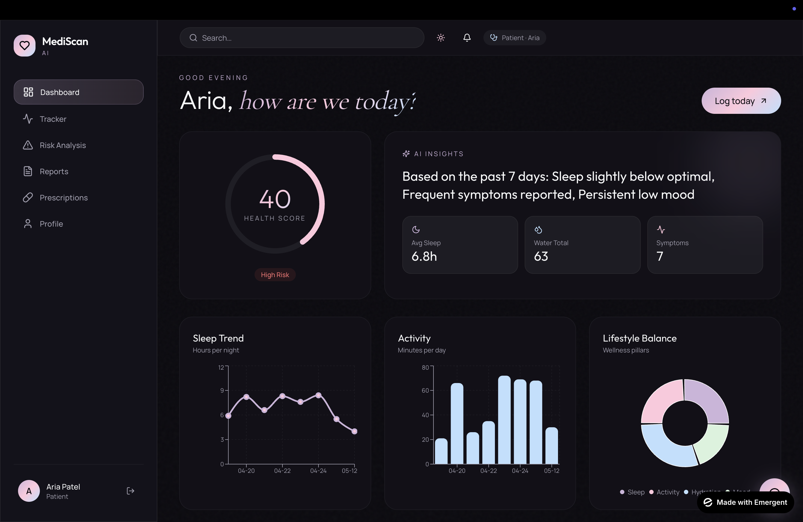
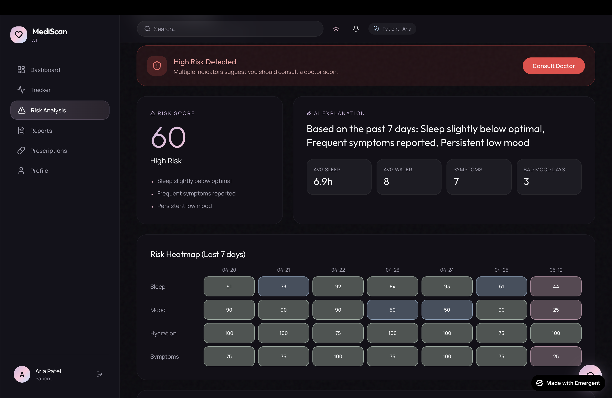
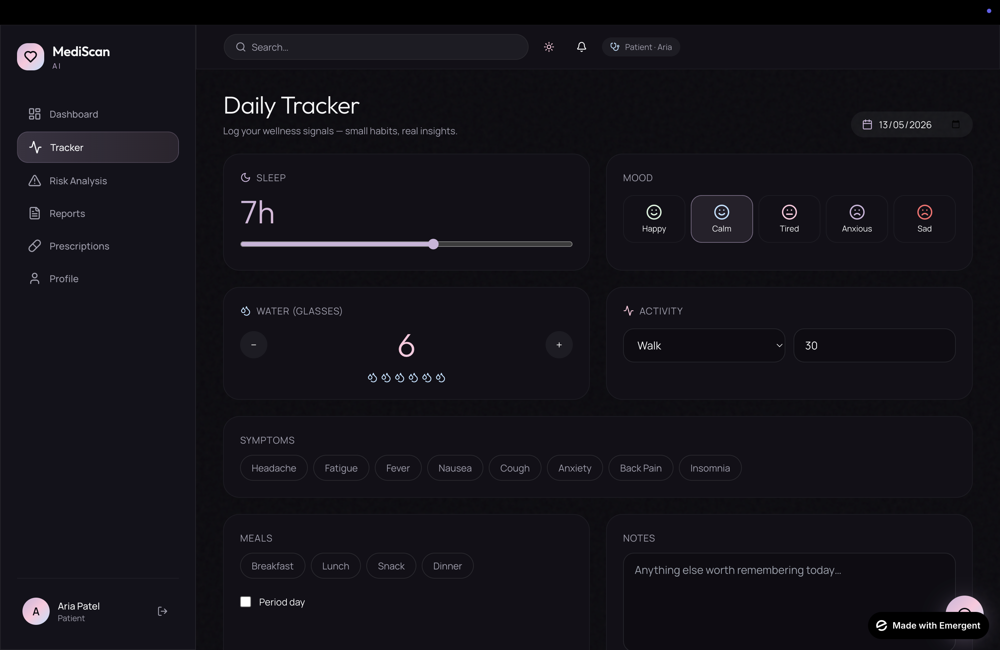

# 🩺 MediScan AI

MediScan AI is a premium AI-powered healthcare SaaS concept focused on wellness tracking, AI health insights, risk analysis, and doctor connectivity.

## ✨ Features
- AI Health Insights
- Health Score Dashboard
- Risk Analysis
- Sleep & Activity Tracking
- Doctor Connect
- Health Reports

## 🎯 UI/UX Focus
Designed with a premium healthcare-first experience using modern SaaS design principles, accessibility, and AI-centered workflows.

## 🛠️ My Contribution
- Product Design
- UI/UX Design
- User Flow Planning
- AI-Assisted Prototyping (Emergent)

## live preview
 
Preview Link: https://wellness-scan-suite.preview.emergentagent.com

## 📸 Screenshots

### Dashboard

### Landing Page

### Health Analytics

### Health Tracker

## 🚀 Project Goal
To create a modern, accessible, and AI-driven healthcare experience that simplifies wellness tracking and patient engagement.
